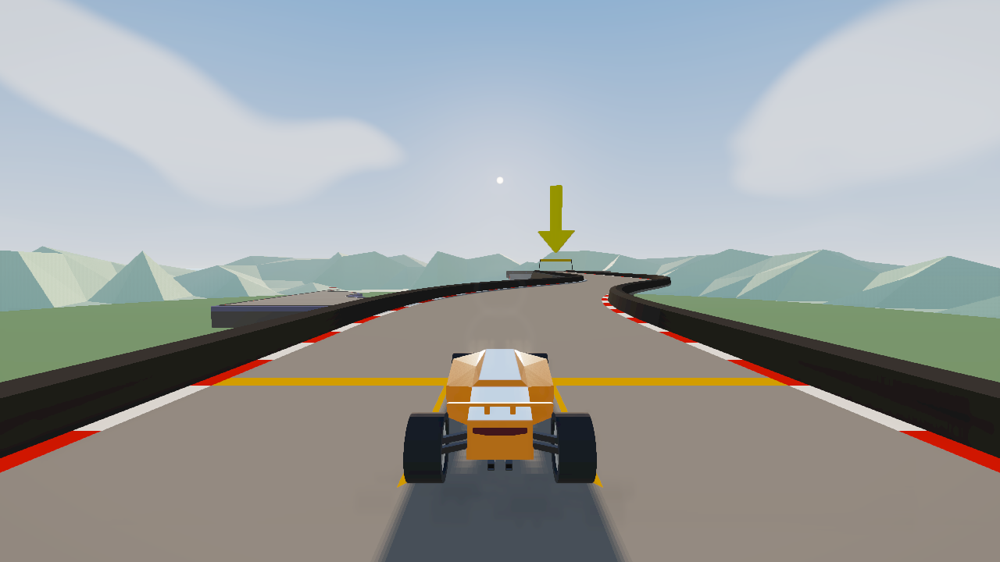
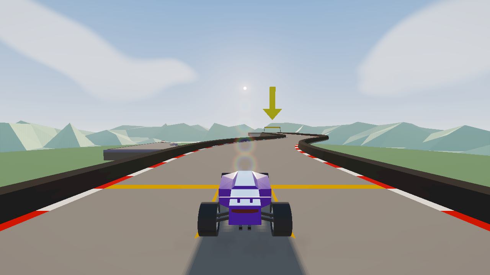
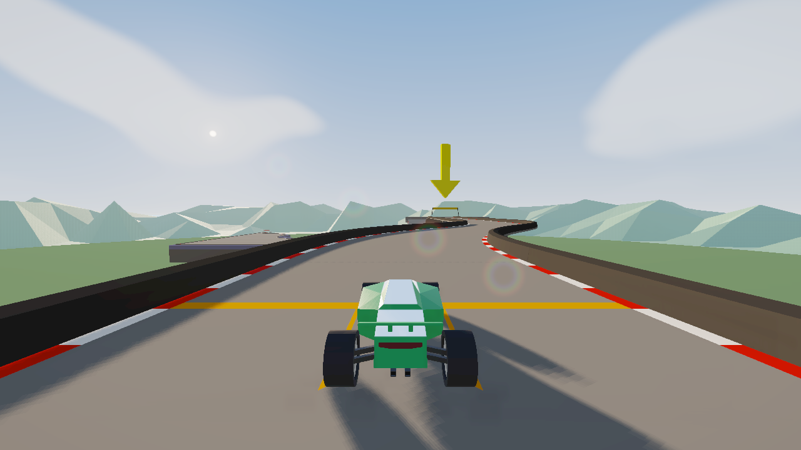
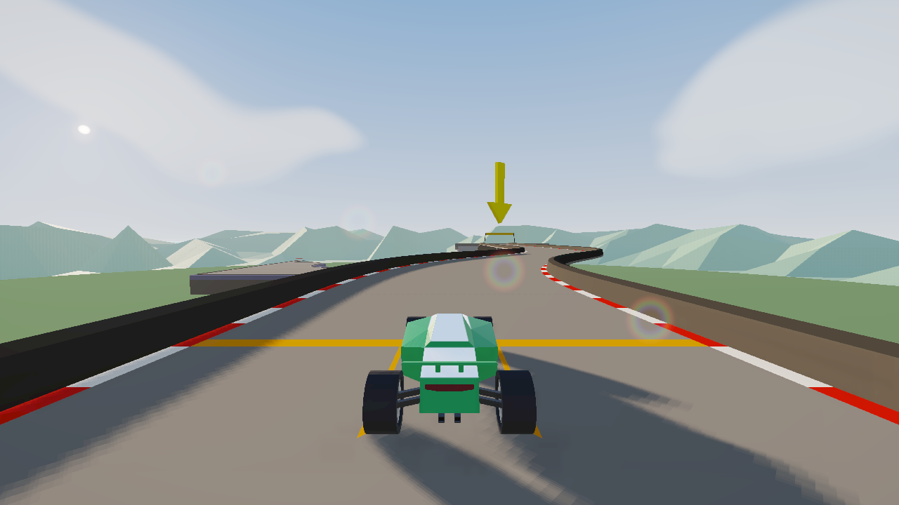
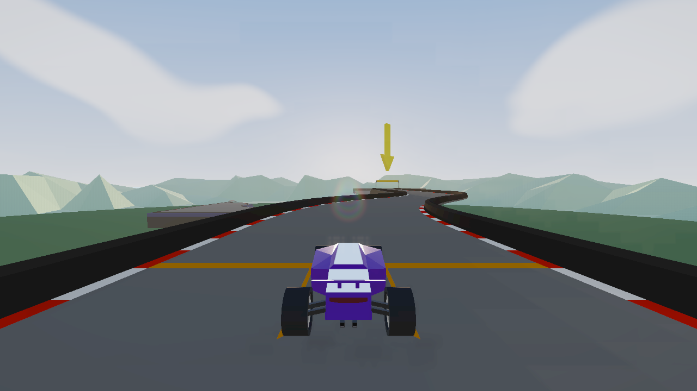
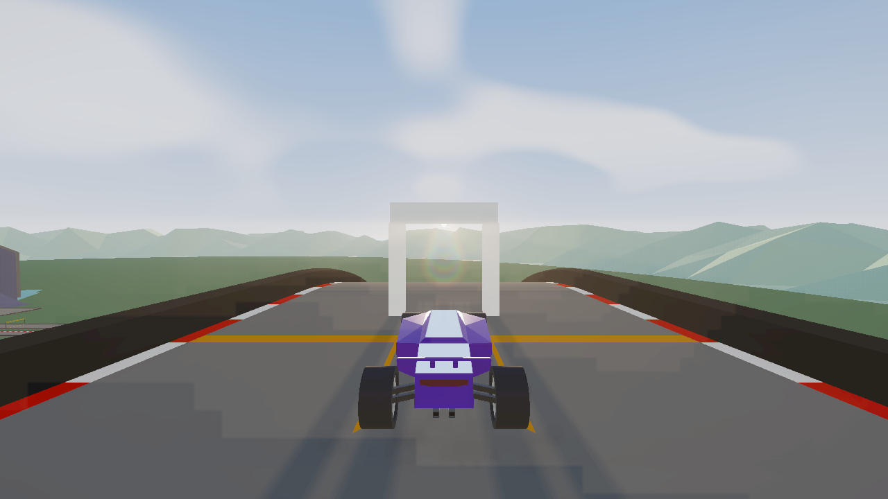
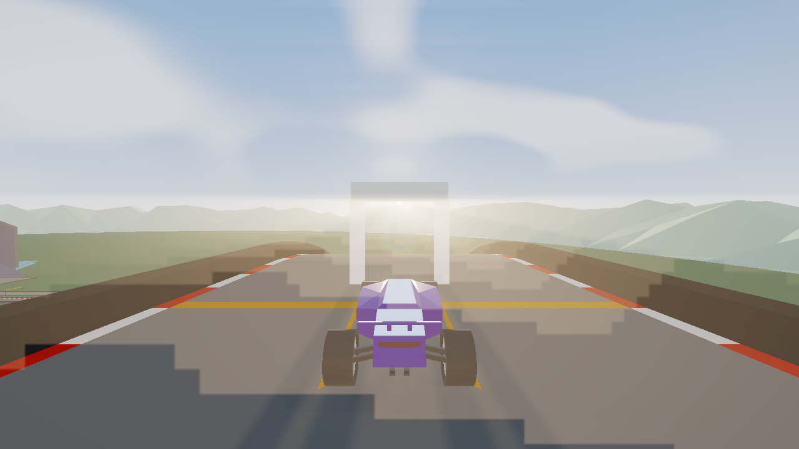
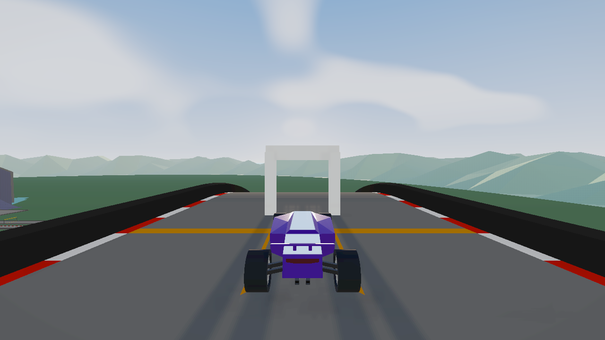
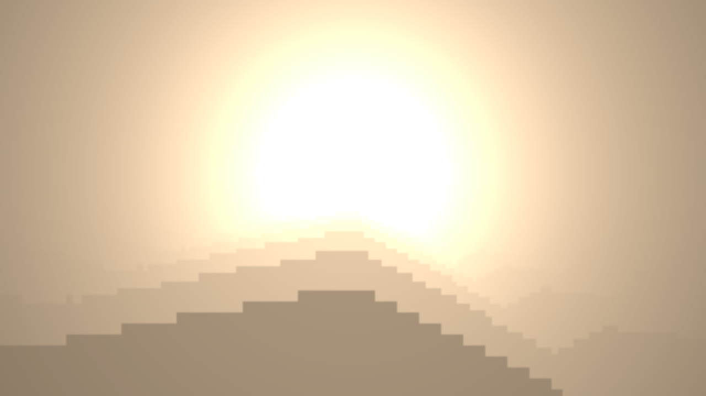
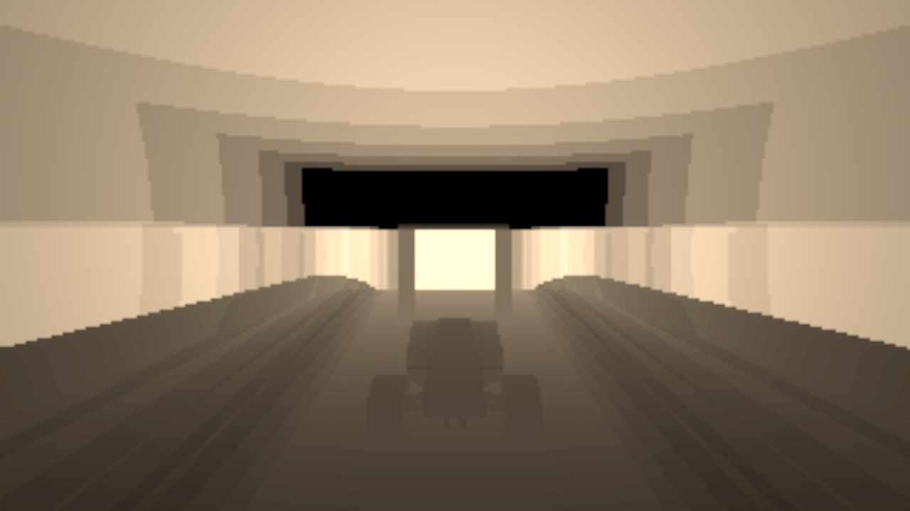

# PolyShade 0.2.2 sun effects calibration

PolyShade 0.2.2 recalibrates the sun optics that were difficult to see in 0.2.1. The sky shader, cloud silhouettes, colour palette, road and car art remain unchanged. The changes increase effect visibility through the existing depth-aware screen-space pipeline and add checks that skip the optics when the sun cannot affect the image.

## What changed

The old sun halo was `0.16 × flareStrength` (about 0.019 for Golden Hour and 0.029 for Capture, before later masks). A ring contributed `0.12 × ghostStrength × flareStrength`, about 0.005 and 0.008 respectively. Its RGB shift was only `0.003 × iridescence`, about 0.001 pixel-UV against a ring width of 0.008. The streak multiplier was `0.04 × streak × flare`, about 0.0003 in Golden Hour. Those values left the optics hard to distinguish in normal play.

The old ray path used `4 × clear × (1 - clear)` as its visibility gate, so fully visible suns produced no rays. The CPU also skipped the ray pass unless visibility was partial, and suppressed rays when volumetrics were enabled with a clear sun. Finally, a foreground-depth gate rejected road and barrier pixels from the composite. Rays therefore disappeared in open sky, in the Capture preset, and over much of the visible scene.

In 0.2.2, a faint open-sky contribution is blended with the stronger partial-occlusion response. Ray samples start at the sun and use normalized weights, and the depth-tested source mask preserves scene occlusion while shafts can composite over foreground surfaces. Flare now uses a localized halo, four soft rings along the sun-to-screen-centre axis, wider restrained channel separation and a stronger optional streak. Cloud transmission attenuates the halo and the shared visibility/cloud data drives optics and scattering. Rays remain available with volumetrics, at reduced strength, so enabling both does not double the shafts.

A projected-sun screen gate fades at the image edge and disables effects behind the camera or beyond the supported screen margin. Fully blocked suns also skip ray, flare and scattering work. The depth mask and procedural sun direction are shared across the effects.

## Defaults

| Preset | Rays | Flare / ghosts / iridescence / streak | Volumetric sunlight |
| --- | --- | --- | --- |
| Golden Hour Lite | Off | Off | Off |
| Golden Hour | On, strength 0.14 | 0.32 / 0.65 / 0.65 / 0.12 | Off |
| Golden Hour Capture | On, strength 0.24 | 0.46 / 0.80 / 0.75 / 0.17 | On, strength 0.08, density 0.008, 8 samples |

Ray decay defaults to 0.96, density to 0.8 and exposure to 0.5. Volumetric decay defaults to 0.96 and maximum distance to 80. The Capture scattering target is quarter resolution: 320 × 180 at a 1280 × 720 output, and 400 × 225 at the 1600 × 900 Capture render size. Volumetric samples remain depth-limited to the visible surface or maximum distance; there is no full-screen world fog or temporal history.

## Live verification

The live harness ran PolyTrack 0.6.3 through PolyModLoader 0.6.3 in Microsoft Edge 154 at 1280 × 720, with the production-built mod. It captured real game geometry and verified these cases:

| Case | Live result |
| --- | --- |
| Clear sun | Screen visibility 1, clear 1; rays, flare and volumetrics active |
| Sun through cloud | Cloud transmission 0.498 with the sun on screen; cloud silhouettes and palette unchanged |
| Partial track/mountain occlusion | Clear 0.251, partial 0.749; rays, flare and volumetrics active |
| Fully occluded | Clear 0, partial 0; rays, flare and volumetrics inactive |
| Behind camera | Screen visibility 0; rays, flare and volumetrics inactive |
| Near horizontal screen edge | Sun at U=0.094; smooth edge visibility remains active |
| Sun through arch | Compared live frames with volumetrics on and off; road remains readable |
| Bridge fully blocking sun | Compared live frames with volumetrics on and off; blocked contribution is suppressed |

The diagnostic views expose sun position, visibility/cloud mask, ray buffer and volumetric buffer. The browser run completed with no isolated shader failures and no WebGL errors. The game driver printed floating-point precision warnings for generated shader programs; these did not cause a compilation failure or appear in the mod failure report.

| Live capture | Evidence |
| --- | --- |
| Visible sun, before 0.2.2 |  |
| Visible sun, 0.2.2 |  |
| Sun attenuated by clouds |  |
| Sun near screen edge |  |
| Partial track occlusion |  |
| Arch scattering on / off |   |
| Bridge fully blocks sun |  |
| Ray and volumetric debug buffers |   |

The live harness writes its full JSON report and additional captures to `%TEMP%/polyshade-0.2.2/`.

## Performance comparison

Matched harness runs used the same machine, Edge build, 1280 × 720 output, presets, warm-up and sample windows. These are one run per version, made separately, so normal machine and browser scheduling variance is visible. GPU values come from asynchronous timer queries; CPU values measure renderer submission and driver wait, not the entire game frame.

| Preset | GPU avg 0.2.1 ? 0.2.2 | GPU p95 0.2.1 ? 0.2.2 | CPU avg 0.2.1 ? 0.2.2 |
| --- | ---: | ---: | ---: |
| Vanilla | 3.13 ? 3.18 ms (+1.3%) | 3.49 ? 3.58 ms | 4.45 ? 4.22 ms |
| Golden Hour Lite | 8.15 ? 9.02 ms (+10.6%) | 9.73 ? 14.02 ms | 9.16 ? 9.29 ms |
| Golden Hour | 13.52 ? 11.45 ms (-15.3%) | 15.57 ? 15.56 ms | 12.27 ? 9.02 ms |
| Golden Hour Capture | 21.46 ? 23.26 ms (+8.4%) | 25.54 ? 26.28 ms | 16.47 ? 15.43 ms |

The Lite p95 was a scheduling outlier relative to its average; these short measurements are directional, not a frame-rate guarantee. A separate low-sun run with the sun effects active measured Capture GPU average at 23.98 ms on 0.2.1 and 24.42 ms on 0.2.2 (+1.8%). The quarter-resolution scattering buffer is 460,800 bytes at 1600 × 900, before driver overhead. The Capture increase in the matched preset run is measurable, so users who prioritize performance can disable volumetrics and/or use Golden Hour. When the sun is behind camera, beyond the edge gate or fully blocked, its optical passes are skipped.

## Scope and limits

Volumetric sunlight is a depth-aware screen-space approximation, not a volumetric renderer. It can show stable shafts through tested arches and around depth-buffered geometry, but cannot infer offscreen occluders. The existing GPU sun mask suppresses fully blocked optics immediately; its asynchronous CPU visibility feedback can lag by a few frames. The cloud test verifies transmission is applied to the sun effect; it does not change cloud appearance. No high-frequency cloud texture, HDRI or alternate sky lighting was introduced.
