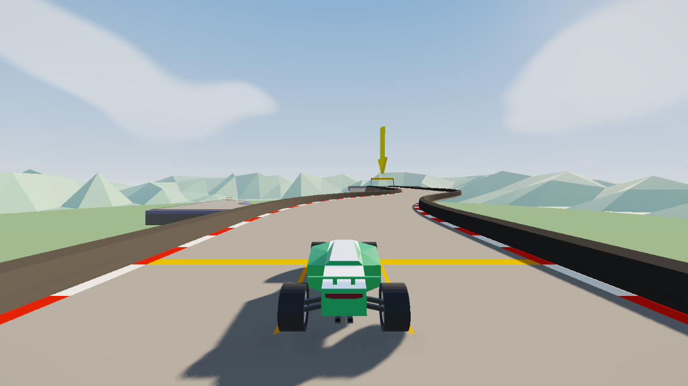
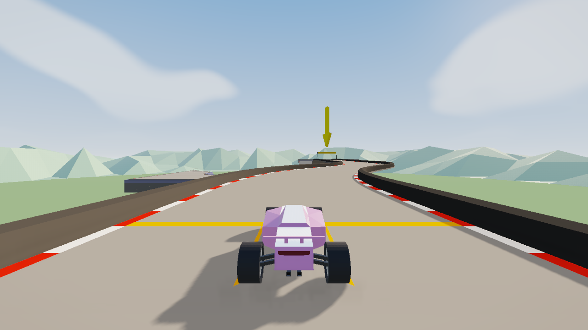
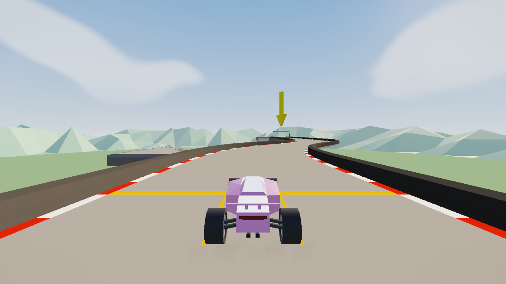
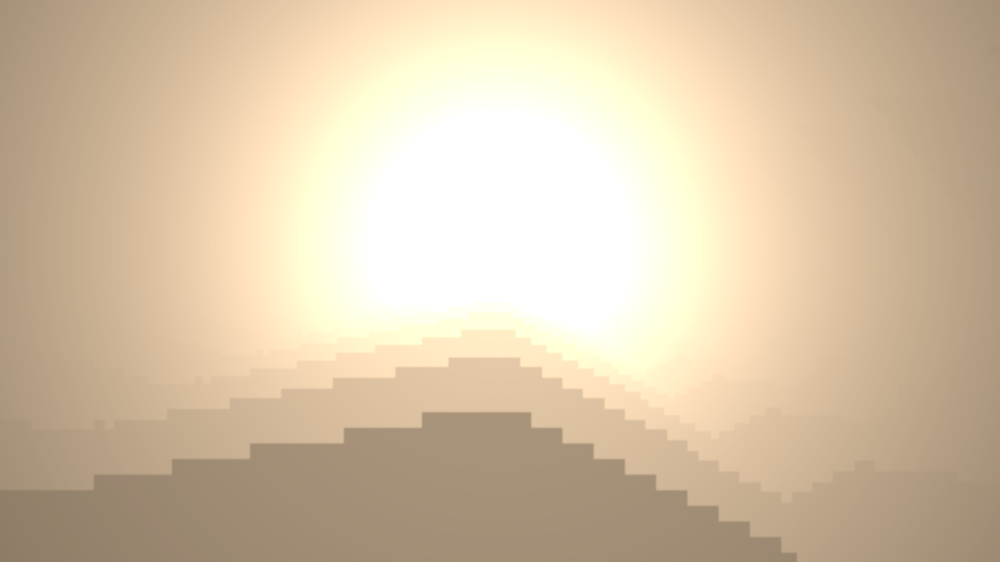

# PolyShade 0.2.3 shadow and shaft fixes

PolyShade 0.2.3 fixes the hard, block-like shadow edges visible in 0.2.2 and raises the resolution of the sun-shaft buffers.

## Black shadow patches

The live A/B test isolated the dark blocks to scene shadows: they disappear when shadow maps are disabled and remain when post-processing is bypassed. The renderer also selected `PCFShadowMap` before `PCFSoftShadowMap`, so it used the hard filter even when soft PCF was available. Changing bias alone did not remove the blocks.

0.2.3 prefers `PCFSoftShadowMap`, raises default shadow softness from 1.5 to 3 and sets shadow strength to 0.68. The new **Shadow strength** control keeps shadowed surfaces from becoming near-black; both new shadow values are restored to their original values when PolyShade disables. Native CSM cascade structure remains game-owned.

## Smoother sun shafts

Radial rays and volumetric scattering now use half-resolution targets, capped at 1024 pixels wide. At 1280 � 720 this is 640 � 360; the prior quarter-resolution targets were 320 � 180. The final ray composite applies a small cross blur. Volumetric upsampling uses five depth-weighted taps, so it smooths the buffer while retaining boundaries at the road and occluders.

The larger targets use four times as many pixels as quarter-resolution buffers when the effect is active. The pass is still skipped if the sun is blocked, behind the camera, offscreen or disabled. Volumetric sunlight remains an optional Capture effect.

## Verification

The live PolyTrack 0.6.3 / PML 0.6.3 run verified the renderer selected the soft PCF mode, exercised shadow-off and post-off isolation, and confirmed 640 � 360 ray and volume targets at 1280 � 720. The full live suite passed with zero WebGL errors and no mod shader failures. The browser emitted existing game shader precision warnings, which did not prevent program compilation.

| Capture                      | Image                                                                      |
| ---------------------------- | -------------------------------------------------------------------------- |
| 0.2.2 shadow baseline        |                         |
| 0.2.3 softened shadow        |  |
| Shadow-off diagnostic        |                 |
| Higher-resolution ray buffer |                              |

The full live report and additional screenshots are written to `%TEMP%/polyshade-0.2.3/`.
