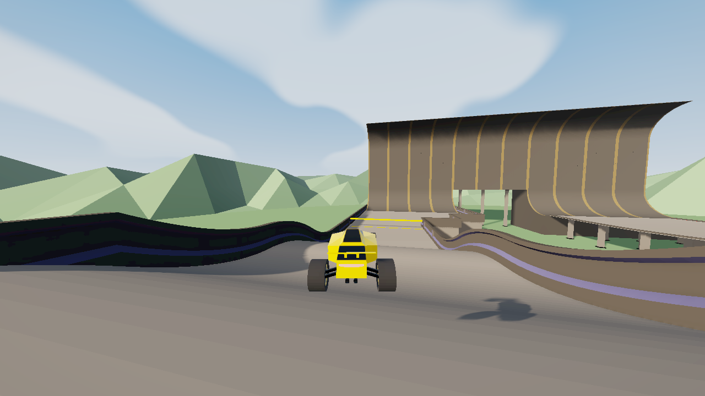
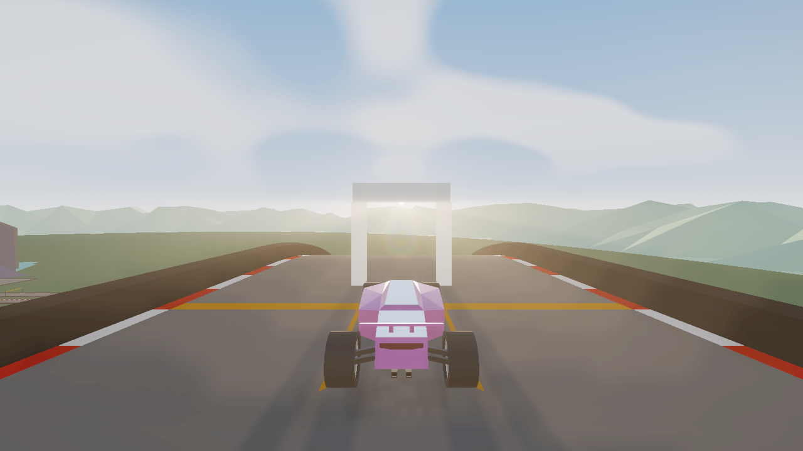

# PolyShade 0.3.0 verification

Tested on 8 October 2026 with Microsoft Edge, a fresh PolyModLoader 0.6.3 profile and a 1280×720 drawing buffer. The previous release was 0.2.8 at commit `a0ecd19090677460dd7449db300e5b2b3229b20e`. Raw measurement summaries are in [verification.json](0.3.0/verification.json).

## Freeze investigation

Brake lights previously changed visibility as braking, camera culling and car visibility changed. This changed the renderer's light count and forced scene shader compilation during driving. Lights now live at the scene root, stay in the renderer's light list at zero power when inactive, and reuse a bounded pool across car reassignment. Warmup submits only the actual light configuration. Contact shadows reuse the contacted track instance before scanning the track; volumetric extinction uses incremental weights and retained targets.

Both releases watched Summer 2's #1 replay, SpeedySebas (15.178 s), with Capture and native shadow quality 3. Fourteen screenshots were sampled during the replay. These are observed timings from one run per release, not a controlled hardware benchmark.

| Measurement | 0.2.8 | 0.3.0 |
| --- | ---: | ---: |
| Largest observed frame gap | 1,690.1 ms | 130.1 ms |
| Largest renderer CPU sample | 1,668.7 ms | 57.3 ms |
| Average renderer CPU sample | 11.03 ms | 9.56 ms |
| Average GPU sample | 26.11 ms | 25.42 ms |
| 95th percentile frame gap | 32.9 ms | 46.1 ms |

The multi-second stall disappeared in this run. Typical frame pacing did not improve across every metric: full-resolution effects and stronger shading add work, and browser scheduling/screenshot capture influence frame gaps. This does not establish that all hardware is free of stalls.

The separate live test repeatedly braked under native CSM: **zero new programs and zero render-target allocations**, with a maximum observed frame gap of 65.5 ms over 121 intervals. Startup, track loading, enabling previously disabled features and changing shadow quality can still require compilation or allocation.

## Shadows and distant black patches

- Removed origin-based distance gating of shadow flags. Native instanced tracks can have their object origin hundreds of metres from the instance being driven on; disabling the whole mesh incorrectly removed receivers and casters.
- Restored native cascade normal biases (0.08, 0.21, 0.6 and 1.9 at 2048), scaling them for lower shadow resolution. Depth bias now accounts for each cascade's actual depth span. The previous near-map bias applied over an approximately 15 km frustum displaced depth by approximately 1.5 m.
- Replaced the contact shadow's unavailable `CircleGeometry` dependency with supported plane geometry. It now attaches in actual PML, follows the moving car every frame, aligns to banked/inverted track instances and disappears across gaps. Local AO supplies contact shading independently of the directional map, including for other geometry.
- Clamped depth reconstruction, rejected degenerate AO normals, faded distant AO and added neutral/fallback paths for invalid effect values. Flare rings use squared distance rather than a GLSL power with a potentially negative base.

The GPU regression tested six depths, including sky depth, with far planes of 1,000, 10,000 and 1,000,000,000. All 18 cases remain finite in 0.3.0. The extreme far-plane sky case fails in 0.2.8; the actual replay camera's far plane is 10,000, so that stress failure alone does not prove the screenshot's cause.

**The exact giant black boxes reported by the user did not reproduce on this GPU, including in the baseline replay.** These changes address verified shadow mistakes and undefined shader arithmetic, but another device/driver may expose an additional cause.

## Full-resolution lighting and visual direction

Volumetric sunlight uses the complete scene resolution, including manual scene supersampling, subject to GPU limits. Rays use the complete output resolution with 64 integration taps. The test reports 1280×720 for both targets; previous half-resolution/1024-wide caps are removed. Filtered depth comparisons and a bilateral composite soften shafts while preserving occluder edges. Volumetric lighting remains off in Lite and Golden and on in Capture. Rays reduce their contribution when volumetrics are active.

Warm sunlight, cooler fill, broad cloud masses, improved paint/metal uniforms and stronger contact shading preserve the stylized low-poly scene. Native material identities and CSM callbacks remain intact. Full-resolution scattering costs more GPU time when visible; it remains a screen-space approximation and cannot account for offscreen occluders.

## Checks

- `npm run check`: build plus **49 passing tests** covering instanced shadows, native material restoration, light pooling, moving/banked contact shadows, warmup and target sizing.
- `npm run verify:live`: actual PML installation, presets, F7 and Vanilla restoration, resizing, braking, driving, cockpit, Summer 1/2/3 loading, native CSM, sky/partial/full occlusion, bridge/arch fixtures and resource disposal cycles.
- `npm run verify:replay`: actual Summer 2 #1 replay, contact-shadow attachment, native cascade state, full-resolution buffers and GPU depth regression.
- No captured runtime/shader errors; GL error zero. Known transient ANGLE compilation warnings also appeared with 0.2.8 during initialization; the final retained-program diagnostic reported no warnings.

The public replay API requires the official game's allowed origin. The replay harness provides a test-only request bridge; it preserves replay responses and does not alter physics, camera transforms, inputs or replay timing. Harness instrumentation is absent from the shipped bundle.

Historical release folders are preserved. The `v0.3.0` tag pins the root manifest and 0.3.0 bundle; the `main` install URL follows future updates. Remove duplicate old mod entries and reselect a preset to apply the new defaults while retaining explicit saved overrides.
