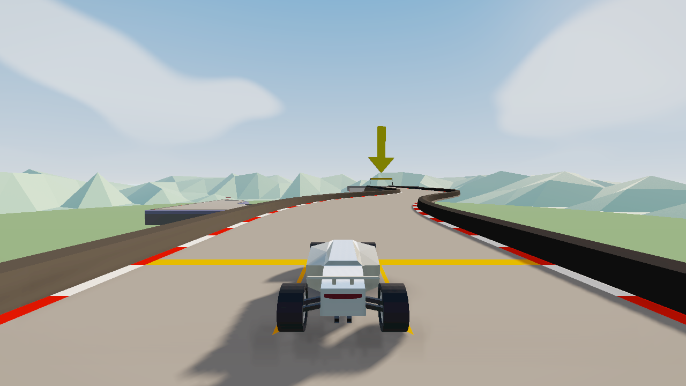
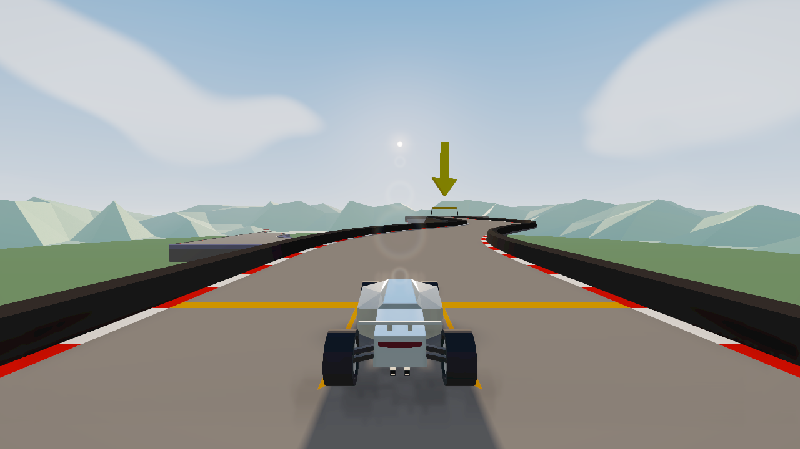
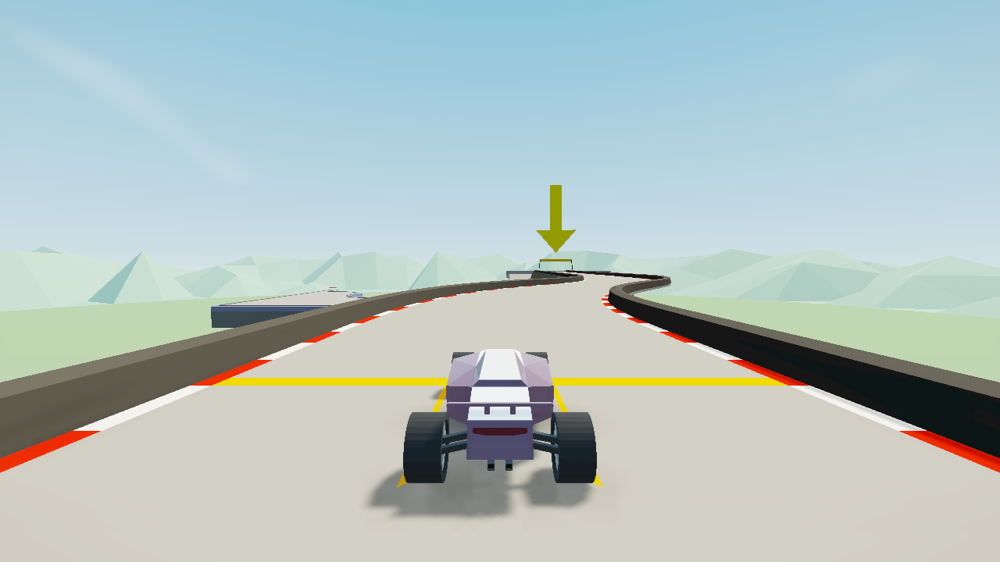
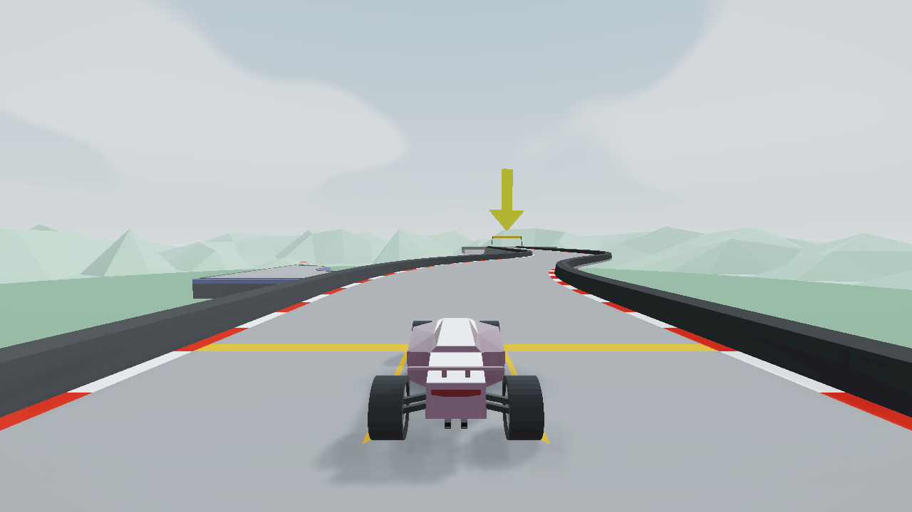

# PolyShade 0.3.1

The car contact decal was only 36% opaque on the road in 0.3.0. The native sun shadow could be much darker while the car was airborne, so the landing looked like the shadow had vanished. The contact decal now reaches 72% opacity near the road, with a smooth squared falloff as the car rises. It still disappears at gaps and follows banked surfaces. The contact shadow integration test checks both grounded and airborne opacity.

The four optical ghosts now use different radii, widths, spacing and brightness, with gentler colour separation. They remain optional and use the same sun and occlusion state as rays and the procedural sky.

Two presets offer different conditions at the same 1× scene resolution without volumetric lighting: **Clear Day** uses a higher, whiter sun and sparse clouds; **Soft Overcast** uses cooler diffuse light, denser broad clouds and softened shadows with rays and lens flare disabled. Each preset changes the existing sky, sun, fill, shadow and grade controls together.

| Clear Day | Soft Overcast |
| --- | --- |
|  |  |

`npm run check` passes all 49 tests. The Summer 2 #1 replay ran through PML with no captured errors and retained full-resolution volumetrics in Capture. The live PML test checked both new presets, shadow state, disable/restore and optical cases. The underlying black-box report remains device dependent; its exact giant boxes have not reproduced on the test GPU.
