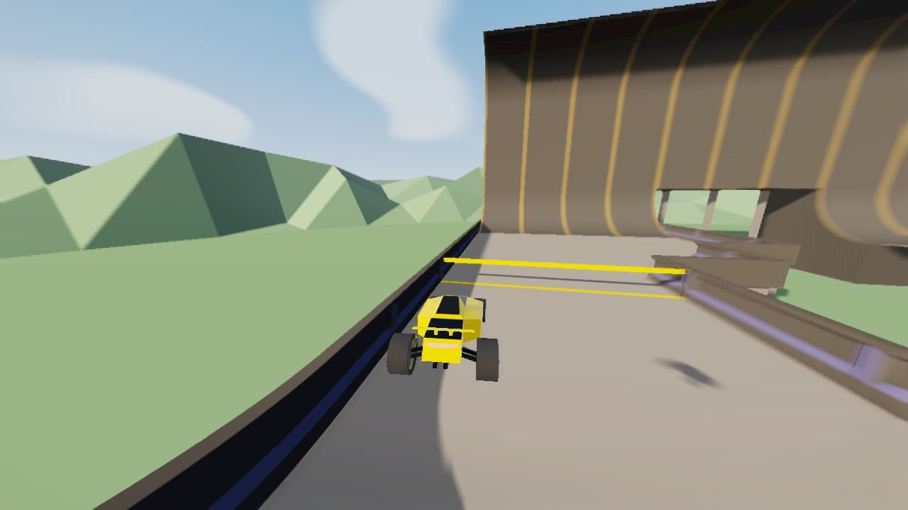
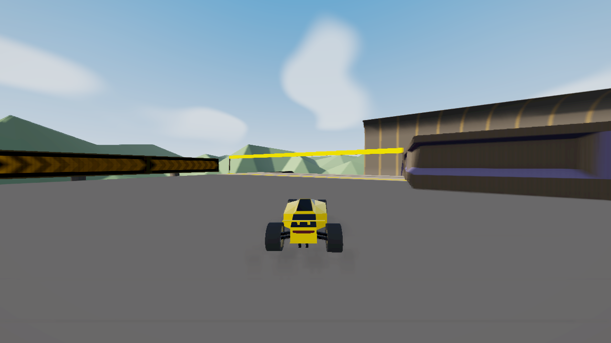

# PolyShade 0.3.3

This release hardens shadow sampling and removes several sources of repeated CPU/GPU work. Existing presets, shadow-map sizes, motion-blur defaults and full-resolution shafts remain available.

## Changes

- Shadow receiver shaders reject invalid homogeneous coordinates and positions outside all six shadow-frustum boundaries before texture sampling. This applies per fragment, including distant instances whose mesh origin is near the player. Cascade fade division uses a nonzero denominator. Native CSM callbacks, uniforms and material handles are preserved and restored on disable.
- Controller and scene application now use the same CSM detection, including materials with a single native cascade. Disagreement previously allowed repeated material restoration and scene rebuilding.
- Exposure, motion blur and other uniform edits keep the existing materials and linked programs. Roughness/reflection settings update uniforms in place. Changes to actual material shader definitions still rebuild the affected material state.
- Shader warming includes hidden native CSM receivers and runs before the scene draw. Its configuration cache prevents uniform edits from restarting the warmup queue. This reduces cold shader compilation when previously hidden scenery enters view.
- Contact shadows use a world-space spatial index of track instances. Index construction is limited to 256 instances or approximately 2 ms per update. Searches test nearby boxes and at most 32 narrow-phase candidates, with a time budget between candidates; crowded searches resume across updates. The previous contacted instance remains the first choice. Whole-track instanced triangle raycasts are removed.
- Offscreen utility scenes and small auxiliary canvases cannot discard the active track's rendering resources. CPU timing now includes the controller's pre-render work.
- The panel displays the installed version, **PolyShade 0.3.3**, to make stale installations apparent.

## Verification

`npm run check`: **60 tests passed**. Regressions cover uniform edits retaining material identity and shader versions, native callback/key restoration, single-cascade detection, banked receivers, auxiliary renderers, and incremental indexing of a 10,000-instance track.

The real PolyTrack 0.6.3 / PML 0.6.3 runtime was tested in **Edge on NVIDIA T500 / ANGLE D3D11**, at 1280×720, using **Summer 2 / SpeedySebas #1**. GPU identification is recorded in the reports rather than inferred from the installed hardware. Golden Hour with High PolyShade shadows was checked against native shadow settings 0, 1 and 3; Capture was checked with native setting 3.

The GPU shadow probe verified that a valid occluder remains dark, while zero/negative homogeneous depth and coordinates outside the light's near/far/x/y bounds remain lit. Twenty-two actual scene receiver materials used the guard in the native CSM replay. Depth reconstruction and motion-blur GPU regressions also passed, with no rendering errors.

Each extended check applied 20 exposure/blur edits and then observed approximately 20 seconds without screenshot readbacks:

| Preset / native shadow setting | New shader programs during edits | New textures/framebuffers | Frame-gap p95 | Longest observed gap |
| --- | ---: | ---: | ---: | ---: |
| Golden Hour / 0 | 0 | 0 / 0 | 23.5 ms | 232.3 ms |
| Golden Hour / 1 | 0 | 0 / 0 | 21.9 ms | 235.8 ms |
| Golden Hour / 3 | 0 | 0 / 0 | 25.3 ms | 371.6 ms |
| Capture / 3 | 0 | 0 / 0 | 20.6 ms | 276.6 ms |

All four samples had zero additional effect-target allocations/disposals and zero context-loss/restoration events. The immutable **0.3.2** baseline, on the local shadow path with the same 20 uniform edits, created **40 shader programs**, compared with **0** in 0.3.3. Its corresponding frame-gap p95 was 41.5 ms. These are individual sequential runs, not a controlled aggregate benchmark.

Capture's volumetric and radial-ray targets remained **1280×720**, matching the scene/output resolution. The PML lifecycle suite verified presets, F7 restoration/re-enable, track reload, camera switching, native cascade rendering, full-resolution lighting and braking without new shader programs or target allocations. Historical release bundles were not modified.

Reports: [native 0](0.3.3/csm0-verification.json), [native 1](0.3.3/csm1-verification.json), [native 3](0.3.3/csm3-verification.json), [Capture](0.3.3/capture-verification.json), [0.3.2 baseline](0.3.3/baseline-0.3.2.json), [lifecycle](0.3.3/lifecycle-verification.json).

## Observed limits

The exact reported black-box screenshot and five-second recovered freeze were **not reproduced** in the tested replay/settings. The fixes address verified invalid shadow sampling and material/resource/search churn; the tests do not prove that every cause of black boxes is eliminated. Short frame spikes remain in the recorded samples, and cold startup shader work reached roughly two seconds in one run. Full-resolution effects and High shadows still have their normal GPU cost. No permanent, all-hardware absence of freezes is claimed.

